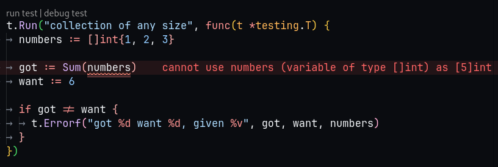

# 04 - Arrays and slices

Os arrays permitem que você armazene vários elementos em uma única variável.

É muito comum que a gente precise iterar sobre os itens deste array e para isso a gente vai utilizar a última função que aprendemos `for`

## Escrevendo o teste primeiro

A ideia é criar uma função que vai somar os números de um array.

Como boa prática, vamos utilizar o test first aqui, então vamos criar um arquivo chamado `sum_test.go` e incluir o teste abaixo:
```go
package main

import "testing"

func TestSum(t *testing.T) {
	numbers := [5]int{1, 2, 3, 4, 5}

	got := Sum(numbers)
	want := 15

	if got != want {
		t.Errorf("got %d want %d given, %v", got, want, numbers)
	}
}
```

Os arrays tem uma capacidade fixa que a gente define na sua inicialização e a gente pode fazer isso de duas formas:

[N]type{value1, value2, ..., valueN} e.g. `numbers := [5]int{1, 2, 3, 4, 5}`

[...]type{value1, value2, ..., valueN} e.g. `numbers := [...]int{1, 2, 3, 4, 5}`

E pra gente 'printar' um array em uma mensagem de erro vamos usar o operador %v que funciona bem para arrays.

## Executando o teste

O esperado é que retorne um erro pois não temos nenhuma função Sum definida.

Irei então criar o arquivo sum.go com um código mínimo para vermos o erro de comparação do teste:

```go
package main

func Sum(numbers [5]int) int {
	return 0
}
```

Dessa forma vamos ter o seguinte erro ao executar o teste novamente:

```bash
--- FAIL: TestSum (0.00s)
    sum_test.go:12: got 0 want 15 given, [1 2 3 4 5]
FAIL
exit status 1
FAIL	golang-with-tests/04-arrays-slices	0.001s
```

## Escrevendo o código para passar o teste

```go
package main

func Sum(numbers [5]int) int {
	sum := 0
	for i := 0; i < 5; i++ {
		sum += numbers[i]
	}
	return sum
}
```

Para que possamos acessar o valor do elemento no ponteiro que o array se encontra usamos numbers[i] onde acessamos o valor do array no indice que o nosso for está iterando.

E então...

```bash
PASS
ok  	golang-with-tests/04-arrays-slices	0.001s
```
## E aquele refactor massa

Vamos usar o `range` para diminuir o nosso código:

```go
package main

func Sum(numbers [5]int) int {
	sum := 0
	for _, number := range numbers {
		sum += number
	}
	return sum
}
```

`range` deixa a gente iterar o array. Em cada iteração o `range` retorna dois valores o index e o value. No exemplo acima o index está sendo ignorado usando o `_` que é chamado de blank identifier.

## Arrays e seu tipo

Uma coisa interessante é que arrays (tirando o do JavaScript que na verdade é um objeto complexo que implementa array junto com outras coisas) sempre vao esperar o mesmo tipo e tamanho, ou seja, se a gente tentar passar um [4]int em uma função que espera [5]int não vai compilar.
Eles são de diferentes tipos então é parecido com querer passar string em uma variável boolean.

E assim como eu (atualmente dev JavaScript) você pode pensar que os arrays nessas linguagens são um porre de trabalhar por sempre ter tipo e tamanho fixo mas a true é que esse problema também ta resolvido.

No Go temos os **slices** que não espera sempre o mesmo tamanho, invés disso, você pode ter qualquer tamanho em um slice.

No próximo exemplo vamos somar coleções de diferentes tamanhos.

## Test first

Agora a gente vai usar o tipo slice, que nos deixa criar coleções de qualquer tamanho. A sintaxe é bem parecida com a do array, você simplesmente pode omitir o tamanho quando estiver declarando ele:

`mySlice := []int{1,2,3}` em vez de `myArray := [3]int{1,2,3}`

```go
package main

import "testing"

func TestSum(t *testing.T) {
	t.Run("collection of 5 numbers", func(t *testing.T) {
		numbers := [5]int{1, 2, 3, 4, 5}

		got := Sum(numbers)
		want := 15

		if got != want {
			t.Errorf("got %d want %d given, %v", got, want, numbers)
		}
	})

	t.Run("collection of any size", func(t *testing.T) {
		numbers := []int{1, 2, 3}

		got := Sum(numbers)
		want := 6

		if got != want {
			t.Errorf("got %d want %d, given %v", got, want, numbers)
		}
	})
}
```

## Rodando o teste e apurando erro

A depender de onde estivermos executando o código o erro já aparecerá na IDE, antes de executar o teste:



E ao executar no terminal também vemos o erro:

```bash
# golang-with-tests/04-arrays-slices [golang-with-tests/04-arrays-slices.test]
./sum_test.go:20:14: cannot use numbers (variable of type []int) as [5]int value in argument to Sum
FAIL	golang-with-tests/04-arrays-slices [build failed]
```

## Escrevendo o mínimo para ver o teste falhar e corrigir

Aqui a gente tem um problema um pouco mais complexo.

Em um serviço de verdade, se a gente só ir e trocar o que a função ta esperando como parâmetro, talvez vamos estragar o nosso dia ou o de alguém, porque tudo que usa esta função será afetado, inclusive os testes...

Neste caso a gente cria uma função nova somente pra lidar com os slices.

Aqui como ninguém está usando ainda, vamos alterar a própria função que já existe pra não precisar criar duas

```go
package main

func Sum(numbers []int) int {
	sum := 0
	for _, number := range numbers {
		sum += number
	}
	return sum
}
```
Se a gente rodar os testes vamos ver que não vai compilar porque a gente precisa ajustar o primeiro teste para aceitar um slice em vez de array:

```bash
# golang-with-tests/04-arrays-slices [golang-with-tests/04-arrays-slices.test]
./sum_test.go:9:14: cannot use numbers (variable of type [5]int) as []int value in argument to Sum
FAIL	golang-with-tests/04-arrays-slices [build failed]
```

E ajustando o primeiro teste para trabalhar com o slice:

```bash
PASS
ok  	golang-with-tests/04-arrays-slices	0.001s
```

## Refatoração

Nós já refatoramos a função `Sum` e a nossa última alteração foi apenas mudando a implementação da função para usar slice em vez de array.

O que acontece é que os testes também merecem esta atenção em relação a refatoração.

O grande ponto aqui é que todo teste tem um custo e processamento, tempo, complexidade de manutenção por menor que ele seja. Em uma codebase grande isso começa a atrapalhar bastante pois as esteiras de publicação e a mantenabiliade deste código começam a ficar ineficientes.

Temos sempre que ser criticos em relação aos testes, nos perguntar se aquele teste faz sentido e se está testando de fato como será implementado.

Vamos ver o nosso arquivo de teste:

```go
package main

import "testing"

func TestSum(t *testing.T) {
	t.Run("collection of 5 numbers in a slice", func(t *testing.T) {
		numbers := []int{1, 2, 3, 4, 5}

		got := Sum(numbers)
		want := 15

		if got != want {
			t.Errorf("got %d want %d given, %v", got, want, numbers)
		}
	})

	t.Run("collection of any size", func(t *testing.T) {
		numbers := []int{1, 2, 3}

		got := Sum(numbers)
		want := 6

		if got != want {
			t.Errorf("got %d want %d, given %v", got, want, numbers)
		}
	})
}
```

Agora que alteramos o primeiro teste para usar slice também os 2 testes estão fazendo a mesma coisa.

Primeiro, vamos rodar os testes com modo de coverage, para saber se todo o nosso código esta coberto por testes. Para fazer isso vamos executar os testes com a flag `go test -cover` e então vamos ter o seguinte resultado:

```bash
PASS
coverage: 100.0% of statements
ok  	golang-with-tests/04-arrays-slices	0.002s
```
Agora vamos remover um dos testes e verificar o quanto ainda está coberto de testes na nossa codebase:

```bash
PASS
coverage: 100.0% of statements
ok  	golang-with-tests/04-arrays-slices	0.002s~
```
Com isso temos que um teste é suficiente na cobertura deste código, pois, se com um slice já foi suficiente para garantirr a integração do código, qualquer slice enviado deveria ter o mesmo comportamento do que já foi testado.

## Outras implementações

Agora a gente vai criar uma nova função chamada SumAll que vai pegar vários slices e retornar um novo slice com a soma dos anteriores.

Por exemplo:
`SumAll([]int{1,2}, []int{0,9}` deve retornar `[]int{3,9}`

ou

`SumAll([]int{1,1,1}` deve retornar `[]int{3}`

## Escrevendo o teste antes

```go
func TestSumAll(t *testing.T) {
	got := SumAll([]int{1, 2}, []int{0, 9})
	want := []int{3, 9}

	if got != want {
		t.Errorf("got %v want %v", got, want)
	}
}
```

O resultado já sabemos que vai rolar um undefined:

```bash
# golang-with-tests/04-arrays-slices [golang-with-tests/04-arrays-slices.test]
./sum_test.go:19:9: undefined: SumAll
FAIL	golang-with-tests/04-arrays-slices [build failed]
```

## Escrevendo o mínimo, falhando e corrigindo através do teste

A gente precisa definir a função SumAll de acordo com o que o teste pede.

Go deixa a gente escrever *variadic functions* que deixa a gente passar vários argumentos de uma vez só em uma função.

```go
func SumAll(numbersToSum ...[]int) []int {
	return nil
}
```

Este código é valido mas o teste não vai compilar ainda:

```bash
# golang-with-tests/04-arrays-slices [golang-with-tests/04-arrays-slices.test]
./sum_test.go:22:5: invalid operation: got != want (slice can only be compared to nil)
FAIL	golang-with-tests/04-arrays-slices [build failed]
```

Go Lang não permite a gente usar operador de igual com slices. A gente pode escrever uma função que vai iterar em cima de cada slice do got e want e checar os valores mas pra não ter esse 'overengeneering' em cima do teste a gente vai usar uma função da lib nativa reflect que é chamada DeepEqual.

Esta denominação é bem conhecida se você já usou algum outro ambiente de teste como ava, jest e basicamente compara se duas variáveis são a mesma coisa:

```go
func TestSumAll(t *testing.T) {
	got := SumAll([]int{1, 2}, []int{0, 9})
	want := []int{3, 9}

	if !reflect.DeepEqual(got, want) {
		t.Errorf("got %v want %v", got, want)
	}
}
```

Então, se o got não for igual ao want, vamos mostrar o ErrorF.

Aqui a gente precisa ter certeza que importamos o pacote reflect no topo do arquivo, beleza?

É importante lembrar que o `reflect.DeepEqual` não é type safe então a gente pode comparar melão com furadeira que só vai falar que é diferente, vai compilar. Exemplo:

```go
func TestSumAll(t *testing.T) {

	got := SumAll([]int{1, 2}, []int{0, 9})
	want := "GO LANG EH DAORA"

	if !reflect.DeepEqual(got, want) {
		t.Errorf("got %v want %v", got, want)
	}
}
```

Não faz sentido nenhum comparar um slice com uma string né? Mas mesmo assim vai retornar algo como:

```bash
--- FAIL: TestSumAll (0.00s)
    sum_test.go:27: got [] want GO LANG EH DAORA
FAIL
exit status 1
FAIL	golang-with-tests/04-arrays-slices	0.001s
```

A apartir do Go 1.21 temos um pacote padrão chamado **slices** que contém a função slices.Equal que faz uma simples comparação entre os itens de dois slices.

Esta função espera elementos para serem comparados então ela não se aplica em slices com elementos que não da pra serem comparados, como um slice 2D.

Agora vamos mudar o teste novamente pra validar o output:

```go
func TestSumAll(t *testing.T) {
	got := SumAll([]int{1, 2}, []int{0, 9})
	want := []int{3, 9}

	if !slices.Equal(got, want) {
		t.Errorf("got %v want %v", got, want)
	}
}
```

Desta vez removi a importação do reflect e importei o pacote slices para exemplo e obtive o retorno:

```bash
--- FAIL: TestSumAll (0.00s)
    sum_test.go:26: got [] want [3 9]
FAIL
exit status 1
FAIL	golang-with-tests/04-arrays-slices	0.001s
```

## Escrevendo o suficiente para o teste passar

Basicamente a lógica da nossa função SumAll será

- Iterar sob as variáveis do argumento da função
- Calcular a soma de cada iteração com a função Sum existente
- Adicionar o resultado no slice que vamos retornar

```go
func SumAll(numbersToSum ...[]int) []int {
	lengthOfNumbers := len(numbersToSum)
	sums := make([]int, lengthOfNumbers)

	for i, numbers := range numbersToSum {
		sums[i] = Sum(numbers)
	}

	return sums
}
```

Aqui temos uma nova forma de criar um slice usando o `make`. Esta função permite a gente criar o slice com a capacidade de elementos do `len` de `numbersToSum` que a gente precisa percorrer.

Então se tiver 5 arrays dentro de `numbersToSum` make irá criar um slice que iniciará do 0 mas poderá ter 5 elementos.

A gente pode acessar os valores do slice usando o index, igual nos arrays. `myslice[i]`

## Refatoração

Como comentado, os slices tem uma capacidade definida e se em um slice de 3 elementos a gente tentar acessar `mySlice[20] = 1` vamos ter um erro de runtime.

Pra gente se preocupar menos com isso podemos usar a função `append` que pega o slice e o novo valor e retorna um novo slice com todos os itens dentro

```go
func SumAll(numbersToSum ...[]int) []int {
	var sums []int
	for _, numbers := range numbersToSum {
		sums = append(sums, Sum(numbers))
	}

	return sums
}
```

Nesta forma de implementar a gente se preocupa menos com o lance da capacidade. Simplemente inciamos um slice vazio e ai a gente vai adicionando ao resultado da função Sum enquanto a gente vai trablhando nas variáveis do argumento.

## Criando mais um comportamento

Agora, vamos criar o SumAllTAils que vai calcular o total dos tails de cada slice. O tail de uma collection são todos os itens da mesma exceto o primeiro item, que é o head.

## Escrevendo o teste primeiro

```go
func TestSumAllTails(t *testing.T) {
	got := SumAllTails([]int{1, 2}, []int{0, 9})
	want := []int{2, 9}

	if !slices.Equal(got, want) {
		t.Errorf("got %v want %v", got, want)
	}
}
```

Agora vamos escrever o mínimo para passar

```go
func SumAllTails(numbersToSum ...[]int) []int {
	return nil
}
```

O resultado do teste será

```bash
--- FAIL: TestSumAllTails (0.00s)
    sum_test.go:35: got [] want [2 9]
FAIL
exit status 1
FAIL	golang-with-tests/04-arrays-slices	0.001s
```

## Escrevendo o código suficiente para passar o teste

```go
func SumAllTails(numbersToSum ...[]int) []int {
	var sums []int
	for _, numbers := range numbersToSum {
		tail := numbers[1:]
		sums = append(sums, Sum(tail))
	}
	return sums
}
```

A loucura aqui é que slices podem ser *sliiiiiiiicedddddddddd* (Cariani Renato).

Podemos 'fatiar' o nosso slice com a sintaxe `slice[low:high]`. Se você omitir o valor em algum dos lados do `:` ele vai capturar tudo que tiver daquele lado. No nosso caso ai em cima ta falando que a gente vai pegar do 1 em diante, até o fim `numbers[1:]`.

E então:

```bash
PASS
ok  	golang-with-tests/04-arrays-slices	0.001s
```

Niceeeee.

## Refatoração

Não tem muito o que refatorar aqui mas podemos incluir um teste e validação a respeito de slices vazios.

O que acontece se for passado um slice vazio no meio dos argumentos?

## Testes antes

```go
func TestSumAllTails(t *testing.T) {
	t.Run("sums of slices", func(t *testing.T) {
		got := SumAllTails([]int{1, 2}, []int{0, 9})
		want := []int{2, 9}

		if !slices.Equal(got, want) {
			t.Errorf("got %v want %v", got, want)
		}
	})

	t.Run("sums of empty slices", func(t *testing.T) {
		got := SumAllTails([]int{}, []int{2, 3, 6})
		want := []int{0, 9}

		if !slices.Equal(got, want) {
			t.Errorf("got %v want %v", got, want)
		}
	})
}
```

Se a gente executar os testes vamos ter um erro mais cabuloso no terminal, parecido com isso:

```bash
--- FAIL: TestSumAllTails (0.00s)
    --- FAIL: TestSumAllTails/sums_of_empty_slices (0.00s)
panic: runtime error: slice bounds out of range [1:0] [recovered]
	panic: runtime error: slice bounds out of range [1:0]

...[stacktraceinfos]
FAIL	golang-with-tests/04-arrays-slices	0.004s
```

A gente pegar esse tipo de coisa com um erro na hora da compilação é benéfico porque eles ajudam a gente a escrever software que funciona, runtime erros são os pnc* que afetam diretamente o usuário...

## O suficiente para funcionar

```go
func SumAllTails(numbersToSum ...[]int) []int {
	var sums []int
	for _, numbers := range numbersToSum {
		if len(numbers) == 0 {
			sums = append(sums, 0)
		} else {
			tail := numbers[1:]
			sums = append(sums, Sum(tail))
		}
	}
	return sums
}
```

## Refatoração

Podemos mudar duas coisas aqui:

- Os testes podem ter uma função de assertividade para evitar ficar repetindo o mesmo código
- Podemos eliminar o else usando o continue no if que criamos

```go
func TestSumAllTails(t *testing.T) {
	checkSums := func(t testing.TB, got, want []int) {
		t.Helper()
		if !slices.Equal(got, want) {
			t.Errorf("got %v want %v", got, want)
		}
	}

	t.Run("sums of slices", func(t *testing.T) {
		got := SumAllTails([]int{1, 2}, []int{0, 9})
		want := []int{2, 9}
		checkSums(t, got, want)
	})

	t.Run("sums of empty slices", func(t *testing.T) {
		got := SumAllTails([]int{}, []int{2, 3, 6})
		want := []int{0, 9}
		checkSums(t, got, want)
	})
}
```

Aqui em vez da gente criar uma função checkSums a gente atribuiu a função a uma variável, o que é completamente normal, é como uma string ou int e quem vem do JS já está acostumado com isso, por exemplo.

Isso também te da um controle maior de escopo, visto que aquela variável só vai ser acessível dentro daquela função, em vez de uma função que esteja dentro do arquivo já, saca?

Esconder essas coisas que outras funções não precisam acessar é uma boa para o design do sistema.

O side effect que a gente tem é se alguem passar um parâmetro inválido pra checkSums, dai vamos ter um erro no teste.

Já na implementação podemos mudar para:

```go
func SumAllTails(numbersToSum ...[]int) []int {
	var sums []int
	for _, numbers := range numbersToSum {
		if len(numbers) == 0 {
			sums = append(sums, 0)
			continue
		}

		tail := numbers[1:]
		sums = append(sums, Sum(tail))
	}
	return sums
}
```

continue fará com que o código que esta abaixo não seja executado, ou seja, se não houver nada no slice vamos adicionar 0 e passar para o próximo item do numbersToSum (numbers).

## Resumindo

Aprendizados:

- Arrays
- Slices
  - Várias maneiras de se criar slices
  - Como eles tem uma 'capacidade fixa' porém como podemos usar o `append` para contornar isso
  - Como fazer slice de slices
- `len` para conseguir capturar o tamanho de um array ou slice
- Test coverage
- `reflect.DeepEqual` que pode ser muito últil mas diminui um pouco o type-safety
- `slices.Equal` método 'novo' para comparar slices
- continue no for

Os exemplos estão usando int mas conseguimos usar da mesma forma com strings e outros tipos de dados.

Até o próximo!